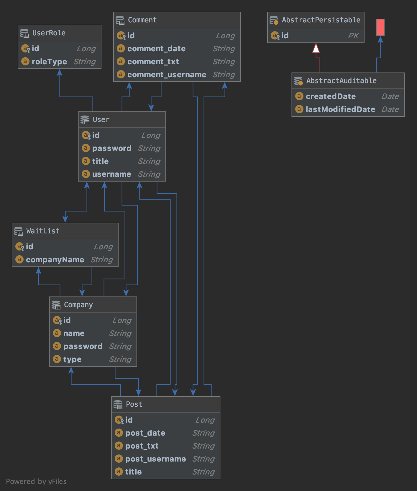
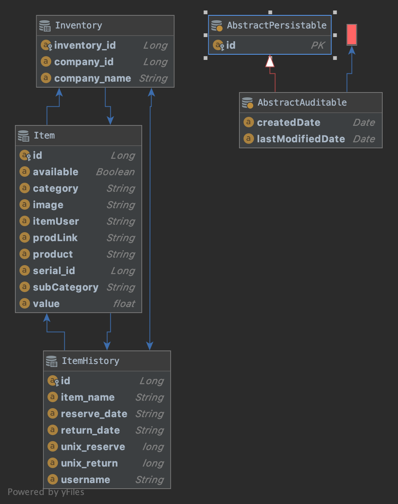
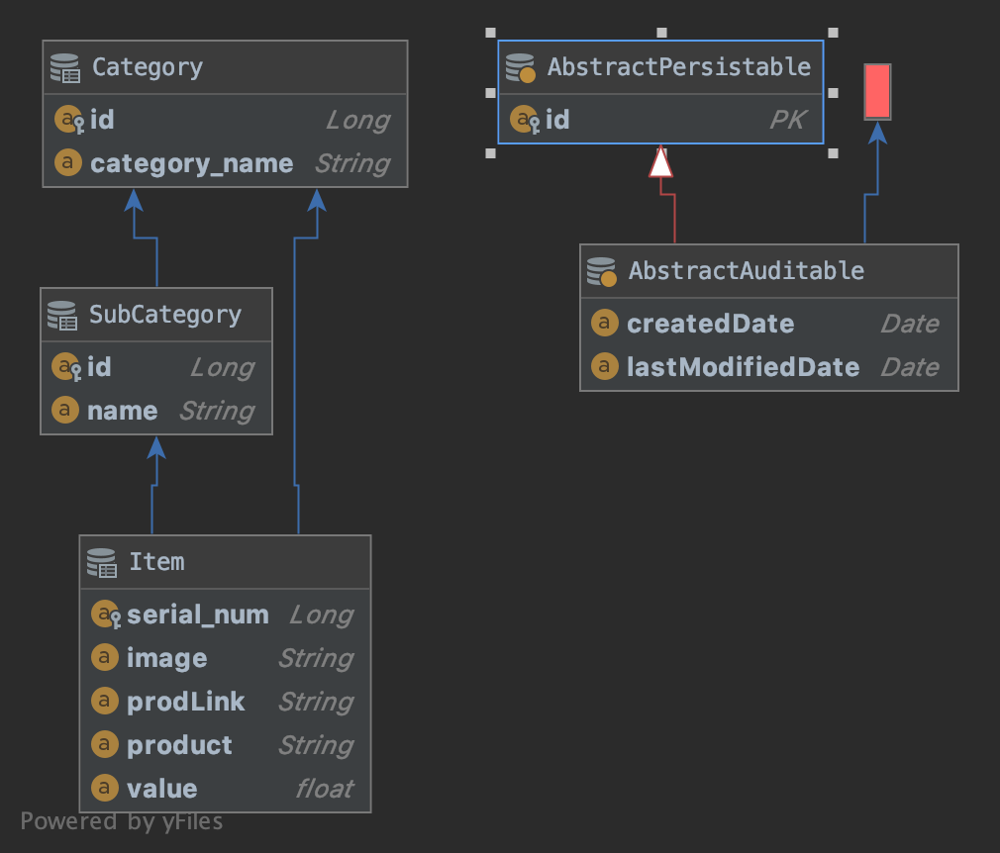

# Equipped
Equipped is a video & photography equipment management application, meant to help film collectives, media companies, or rental houses keep track of their equipment. A user can browse a catalog of items and stash the ones they own into their company inventory. There is a feature that allows you to see who has what piece of equipment checked out, along with a history of the usage. Included in the application is a forum feature that allows a company to communicate.

I made this app after thinking about my time working for a small media company that could have used an equipment manager. This application would have been a good aid for keeping track of who was using what and when.

### What kind of application is this?
Equipped is a dockerized full-stack application with a microservice architecture backend built with Spring Boot, and a React.js frontend.

Note:
I built a web scraper (my "yoink" repository) with Puppeteer that programatically collects links and details about equipment from a particular rental house and stores it in a JSON file, which is then saved to your computer. I inserted that file into this project such that when you start up this application, the equipment-api populates a database with all the information from that JSON file, which is then used in the view (React), allowing a user to browse for and add equipment to their companies inventory.

Mockup (created in Photoshop)


## Requirements
- Docker
- Java 8
- Node.js

## 🛠 🚀 Installation & Set Up
1. Clone the repository.

3. Make sure your ports are clear (8182, 8181, 8082, 8080, 8761, 5432 - refer to docker-compose.yml for services that will run).

4. Docker Desktop should be up and running & allowed to use 3.00 GB of memory. Check this by opening up preferences and navigating to Resources and then Advanced. There you should see a Memory slider that you should adjust accordingly.

5. From the equipped directory in your terminal, use the command: 
    ```sh
    docker-compose up
    ```
5. You can check to see if everything is up and running by using this command in a new terminal tab (note: depending on your machine it might take a few minutes for docker to build all the services for you):
     ```sh
    docker ps -a
    ```
6. If everything is up and running, you should see something like:
```
d270ac45dc34        maven:3.6.2-jdk-8   "/usr/local/bin/mvn-…"   3 days ago          Up 3 minutes              0.0.0.0:8182->8182/tcp   equipped_inventory-api_1
7d6689e86753        maven:3.6.1-jdk-8   "/usr/local/bin/mvn-…"   3 days ago          Up 3 minutes              0.0.0.0:8080->8080/tcp   equipped_api-gateway_1
e5e3eb8a46e9        maven:3.6.1-jdk-8   "/usr/local/bin/mvn-…"   3 days ago          Up 3 minutes              0.0.0.0:8082->8082/tcp   equipped_users-api_1
dcd470ac15d8        maven:3.6.1-jdk-8   "/usr/local/bin/mvn-…"   3 days ago          Up 3 minutes              0.0.0.0:8181->8181/tcp   equipped_equipment-api_1
5f79c9b83787        maven:3.6.1-jdk-8   "/usr/local/bin/mvn-…"   3 days ago          Up 3 minutes              0.0.0.0:8761->8761/tcp   equipped_eureka_1
8ffb4674f7d9        postgres            "docker-entrypoint.s…"   3 days ago          Up 3 minutes              0.0.0.0:5432->5432/tcp   equipped_postgresdev_1
```
7. cd into the client folder, which you'll find in the project directory, and use the command:
    ```sh
    npm run start
    ```
8. This will start a server at ```http://localhost:3000/``` where you'll find your local view.

## 🤖 Entity Relationship Diagrams
* Users Service ERD:


* Inventory Service ERD:


* Equipment Service ERD:

